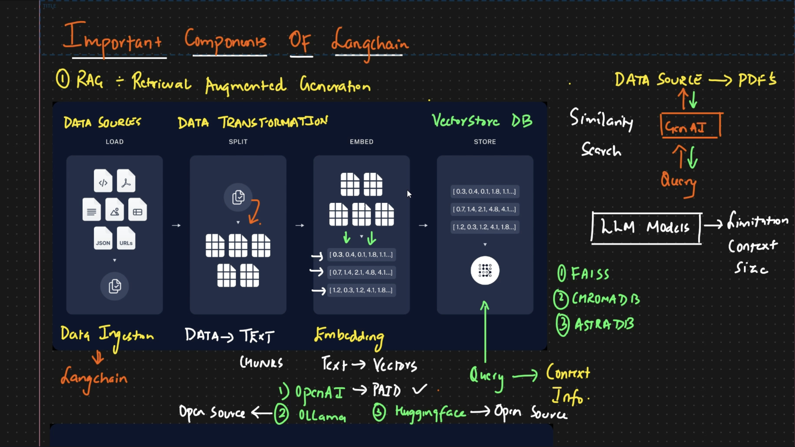

# Agentic AI

#### Create Virtual Env:
1. Using Conda
    - conda create --name <env_name> python==3.12
    - conda activate <env_name>
    - Conda deactivate

### RAG - Retrival Augmented Generation

